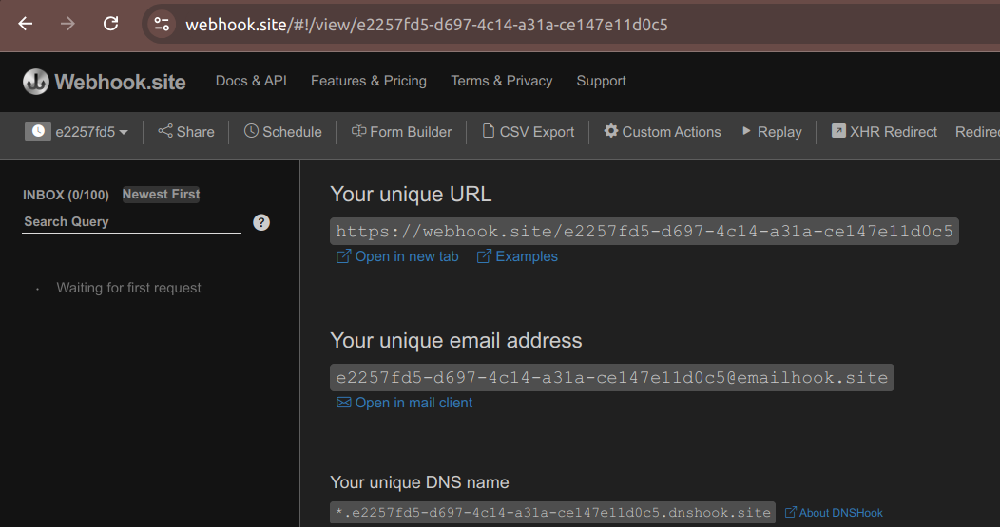

# Webhook.site Logger

This is a dummy output integration that sends whatever data enters the channel to webhook.site. webhook.site is a webhook testing service (like Telex huh?), that allows you to receive any sort of data via http and email. So this integration simply routes messages entering a channel to your "session" webhook.site.

## How to use

1. Install the integration using its JSON URL at:
2. Set the webhook slug in the settings (Org dashboard > Apps > "Telex Webhook.site Logger" > Settings), obtained from https://webhook.site

3. Ensure the integration is activated at the organisation and the individual channels you want to use it at
